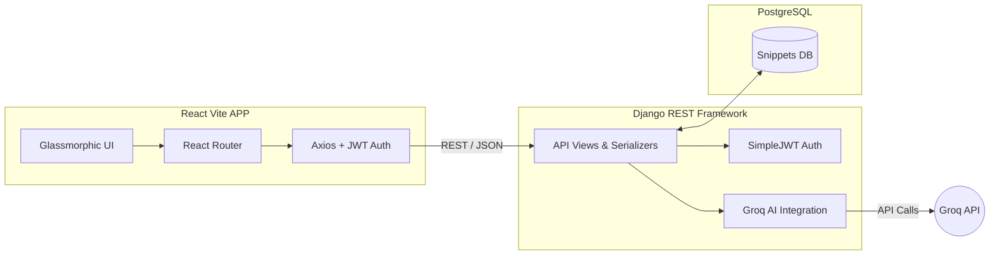
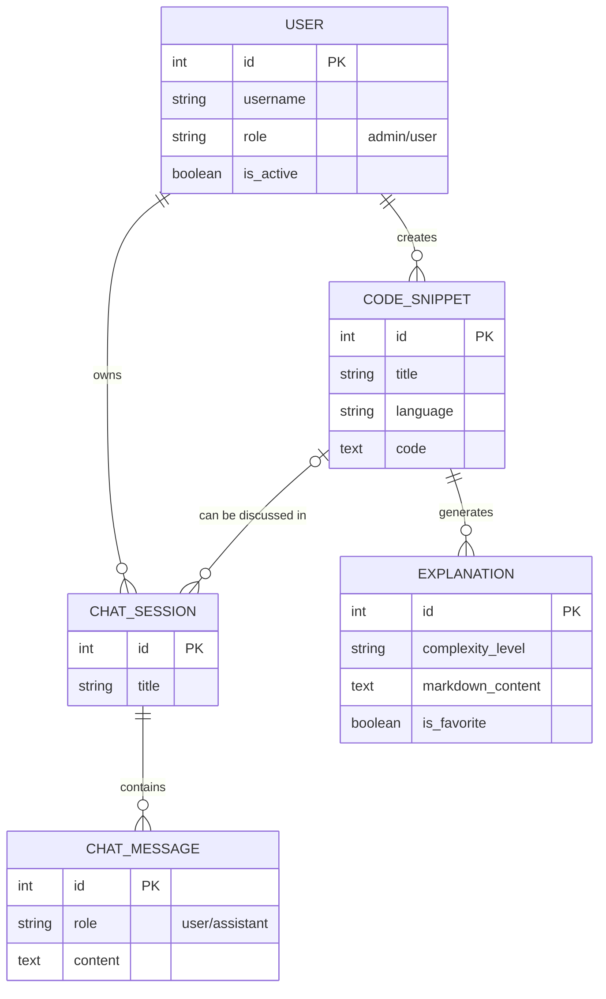

# Code Snippet Explainer App

A modern, full-stack application that allows users to save, explore, and run AI explanations on code snippets. The application combines a Django REST Framework backend with a beautiful, glassmorphic React (Vite) frontend.

---

## 🏗️ Architecture Overview

The system operates as a unified Single Page Application (SPA), decoupling the UI from the database modeling via a robust REST API.



---

## 🎨 Frontend (React + Vite + Tailwind v4)

Located in the `/frontend` directory, the frontend focuses on a strict 5-color "Glassmorphism" aesthetic (`#EDEFDF`, `#323B44`, `#287999`, `#ACB9A5`, `#F0C968`).

### Key Features
* **JWT Authentication**: Full login/register flows with automatic token refreshing via Axios interceptors.
* **Dashboard Engine**: Asymmetric "Bento grid" dashboards for regular users and a dedicated internal Admin control center.
* **Code Interactions**: Syntax highlighting, snippet creation, and side-by-side AI explanation interfaces powered by `react-markdown`.
* **AI Chat Interface**: Real-time chatting interface mimicking ChatGPT, mapping back to the Django `ChatSession` models.

### Project Structure (Frontend)
```text
frontend/
├── src/
│   ├── components/      # Reusable UI pieces (Layout, Inputs, GlassCards)
│   ├── contexts/        # AuthProvider & NotificationContext
│   ├── pages/           # Main Views (Dashboard, Admin, Chat, SnippetDetail)
│   ├── services/        # api.js connection to Django
│   ├── App.jsx          # Route Definitions
│   └── index.css        # Tailwind v4 @theme and custom scrollbar injections
```

---

## ⚙️ Backend (Django + DRF)

Located in the `/backend` directory, this serves the `/api/*` REST endpoints.

### Key Applications
1. **`users`**: Custom user model tracking roles (`admin`, `user`) and auth endpoints.
2. **`snippets`**: Tracks code snippets, language metadata, and generates AI `Explanation` objects using the Groq API.
3. **`ai_chat`**: Provides stateful chat sessions. Users can converse natively against the `llama-3.1-8b-instant` model.
4. **`admin_panel`**: Custom tailored endpoints providing system-wide statistics and moderation capabilities (blocking users, deleting bad content).

### Data Model Schema



---

## 🚀 Getting Started

### Prerequisites
* Node.js v21+
* Python 3.10+
* PostgreSQL

### 1. Database Setup
Create a local PostgreSQL database named `snippets_db`.

### 2. Backend Setup
Navigate to the `backend` directory:
```bash
cd backend
python -m venv venv
# Activate venv:
# Windows: .\venv\Scripts\activate
# Mac/Linux: source venv/bin/activate

pip install -r requirements.txt
```

Create a `.env` file in the `backend/` root:
```ini
DEBUG=True
SECRET_KEY=your-secret-key
DB_NAME=snippets_db
DB_USER=postgres
DB_PASSWORD=postgres
DB_HOST=localhost
DB_PORT=5432
GROQ_API_KEY=your_groq_llama_key
```

Run migrations and start the server:
```bash
python manage.py migrate
python manage.py runserver 8000
```
*The backend API is now running at `http://127.0.0.1:8000/api/`*

### 3. Frontend Setup
Open a new terminal and navigate to the `frontend` directory:
```bash
cd frontend
npm install
npm run dev
```
*The React application is now running at `http://localhost:5173`*

### 4. Administrator Access
To access the `/app/admin` pages, your user must have both `is_staff=True` and `role='admin'`. 
You can create a superuser via the terminal:
```bash
cd backend
python manage.py createsuperuser
```
Then log in on the frontend with those credentials. You can grant admin rights to other users seamlessly from the new Admin Dashboard tab.

---

## 📚 API Documentation
When the backend is running, fully interactive OpenAPI (Swagger) documentation is automatically generated.
Visit: [http://127.0.0.1:8000/api/schema/swagger-ui/](http://127.0.0.1:8000/api/schema/swagger-ui/)
